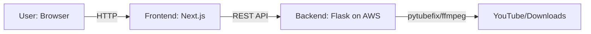

# Architecture Plan: YTVideoMAx

## 1. Requirements
- **Frontend:** Fully decoupled, built with Next.js , hosted on Vercel or Netlify.
- **Backend:** Flask REST API (Python), hosted on AWS (EC2, Elastic Beanstalk, or similar).
- **Communication:** Frontend and backend interact via RESTful API (HTTP/JSON).

## 2. Technology Stack
- **Frontend:** Next.js (React), JavaScript/TypeScript, CSS Modules or TailwindCSS, npm/yarn
- **Backend:** Python, Flask, pytubefix, ffmpeg, virtualenv
- **Hosting:**
  - Backend: AWS (EC2, Elastic Beanstalk, Lambda, etc.)
  - Frontend: Vercel or Netlify

## 3. Proposed Folder Structure
```
Jailbrealk/
│
├── backend/
│   ├── app.py
│   ├── requirements.txt
│   ├── run_downloader.bat
│   ├── downloads/
│   └── ...
│
├── frontend/
│   ├── package.json
│   ├── next.config.js
│   ├── public/
│   ├── src/
│   │   ├── components/
│   │   ├── app/
│   │   └── ...
│   └── ...
│
├── README.md
└── architecture.md
```

## 4. Architecture Diagram


## 5. Recommendations & Best Practices
- **Frontend:**
  - Move all UI logic (HTML, JS, CSS) from `templates/` and `static/` to the Next.js app.
  - Use fetch/axios to call backend API endpoints (e.g., `/download`, `/formats`, `/video_info`).
  - Configure environment variables for API base URL (different for dev/prod).
  - Use Vercel/Netlify for CI/CD and automatic deployments.
- **Backend:**
  - Refactor Flask to serve only API endpoints (no HTML rendering).
  - Enable CORS for frontend-backend communication.
  - Secure API endpoints and validate all inputs.
  - Use AWS for scalable, reliable hosting.
- **API:**
  - Document endpoints and expected request/response formats.
  - Consider rate limiting and authentication if needed.
- **Dev Workflow:**
  - Run backend and frontend separately in development (different ports).
  - Use proxy in Next.js dev server for API calls to avoid CORS issues.
- **Testing:**
  - Add unit/integration tests for backend API and frontend components.
- **Monitoring:**
  - Set up logging and error monitoring (e.g., Sentry, AWS CloudWatch).

---

**Summary:**
- The project will be split into `backend/` (Flask REST API, AWS) and `frontend/` (Next.js, Vercel/Netlify).
- All communication will be via RESTful API.
- This enables independent scaling, modern frontend development, and cloud-native deployment.